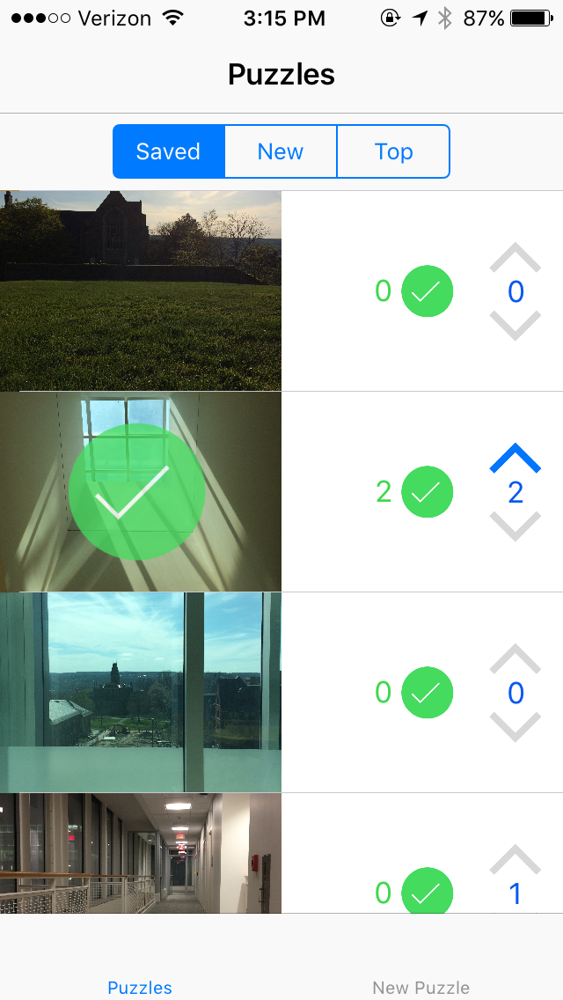
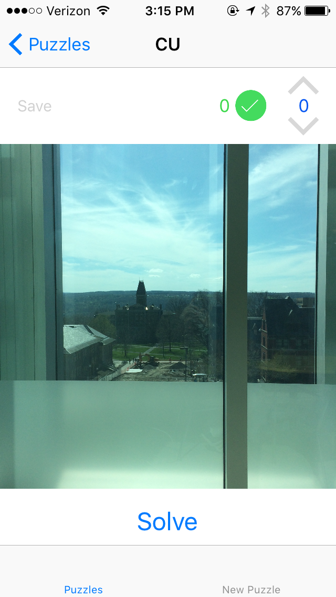
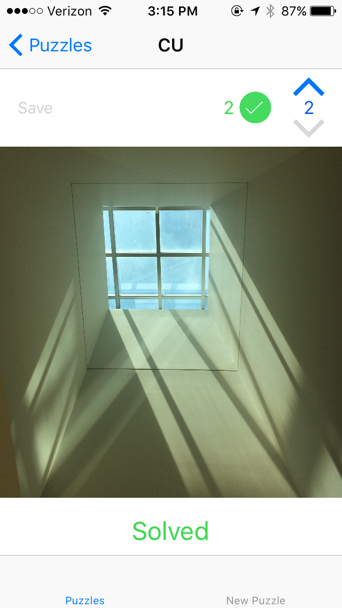
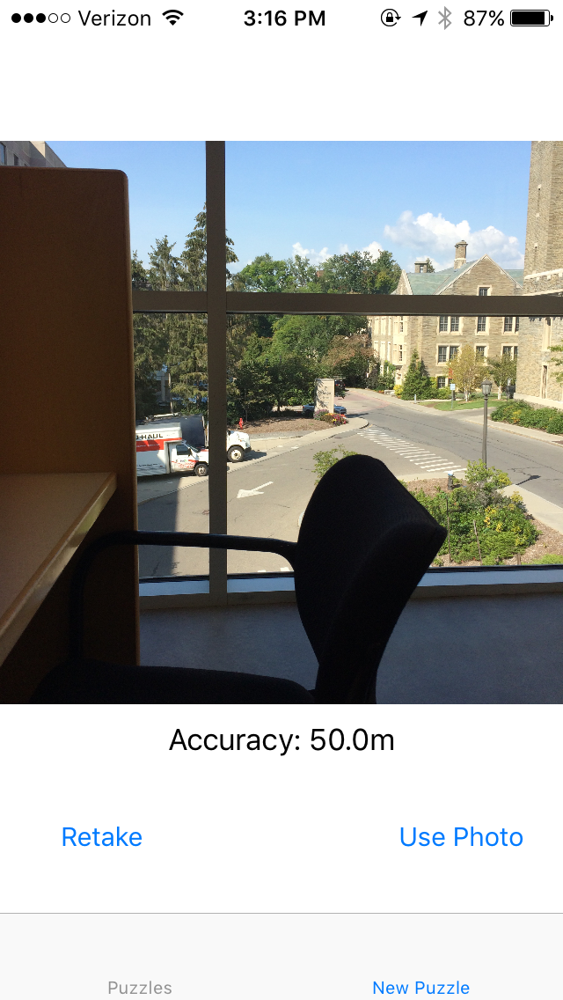

# Picture Puzzle iOS Game

This was my final project for CS 2049: Intermediate iPhone Development. It is an iOS puzzle game where players are presented with a picture, and they must find the location from where the picture was taken. Players can post and solve puzzles.

I used Firebase for the server backend and Realm for the local backend, then CocoaPods for dependency management.

   
